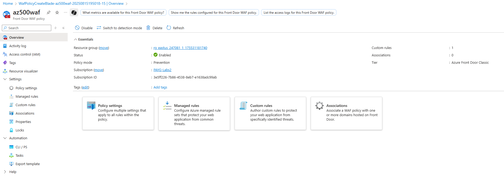

# Configuring Azure Front Door WAF – Whizlabs Lab Implementation

Type: Lab Project — AZ-500 Studies  
Skills: Azure Front Door, Web Application Firewall (WAF), Managed Rules, Custom Rules, Threat Protection

* * *

## Overview

This project replicates the **Whizlabs “Configure Azure Front Door WAF”** lab in Azure.  
The lab focuses on building a Web Application Firewall policy for Azure Front Door, enabling key managed rules (SQL injection and XSS protection), customizing response messages, and creating custom rules for enhanced security.

Lab link: [Whizlabs – Configure Azure Front Door WAF](https://www.whizlabs.com/labs/)

* * *

## Objectives

- Sign in to the **Azure Portal**
- Create a **Front Door WAF Policy** in Prevention mode
- Enable and configure **Managed Rules**
- Configure a **Custom Block Response Message**
- Add a **Custom Rule** to block unknown traffic sources
- Validate successful deployment

* * *

## What I Did

### 1) Sign in to Azure Portal
- Accessed [Azure Portal](https://portal.azure.com)

### 2) Configure Front Door WAF Policy
- Created a new **Global WAF (Front Door)** policy.
- Selected **Classic tier**, added to existing resource group.
- Named policy `waf` and set **Prevention mode**.

### 3) Enable and Configure Managed Rules
- Disabled all rules initially.
- Enabled **SQL Injection** rule (99031001).
- Enabled **XSS protection** rules (94110, 941120, 941130, 941140, 941150).

### 4) Configure Blocked Response Body Message
- Added custom response:  
  **`no SQLi or XSS allowed!`**
- Ensured this response is returned whenever WAF blocks malicious requests.

### 5) Configure Custom Rule – Block Unknown Traffic
- Added custom rule `blockunknown` with priority **1**.
- Match variable: **RemoteAddr**
- Denied traffic from **Unknown country/region**.
- Reviewed and created the policy successfully.

* * *

## Screenshots

### WAF Policy Basics configuration

### Managed Rules enabled for SQLi and XSS

### Custom Block Response Message configured

### Custom Rule to block unknown traffic

### Deployed WAF Policy overview
  

* * *

## Next Steps (outside the lab)

- Integrate WAF logs with **Log Analytics / Sentinel** for visibility.  
- Create additional custom rules for known threat IP ranges.  
- Test simulated SQLi and XSS attacks to validate protection.  
- Configure alerting for triggered WAF events.

* * *

## References

- [Whizlabs – Azure Front Door WAF Lab](https://www.whizlabs.com/labs/)  
- [Microsoft Docs – Azure Web Application Firewall on Azure Front Door](https://learn.microsoft.com/azure/web-application-firewall/afds/afds-overview)
